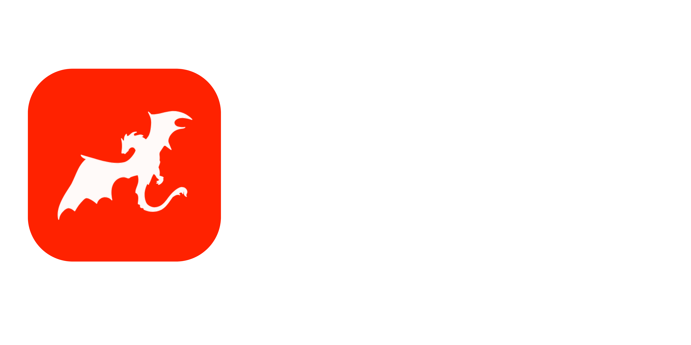

<picture>
  
</picture>

# AGGM Programming Language

### Welcome to AGGM

AGGM is a natural language programming language that uses python as an interpreter. AGGM can have any syntax you want, from pseudo code, to descriptions, to a made-up syntax! AGGM uses the [AggmGPT](https://github.com/Adolfo-GM/AggmGPT-2) local language model to interpret your code with python. AGGM is a great way to learn programming, and is a fun way to code!

To learn more about the AGGM programming language, check out these resources:

- [Getting Started](resources/getting-started.md)
- [Aggm Syntax](resources/aggm-syntax.md)

### Examples

Emoji syntax:

```
def 😎(💦, 😂):
    def 🥳():
        😢 = 💦 / 😂
        return 😢
    return 🥳()

😊 = 😎(150, 3)
print(😊)
```

Made-up syntax:

```
~{  
    >vortex weave &flow /num -> &threads /num :.  
    ~{  
        &strand /num = &flow ^/ &threads :.  
        >return &strand :.  
    }~  

    &glow /num = weave -> 150 -> 3 :.  
    >pulse &glow :.  
}~

```

Pseudo-code syntax:

```
FUNCTION printFibonacci(n)
    // Declare variables for first two numbers and next number
    SET first = 0
    SET second = 1
    
    // Handle edge cases
    IF n <= 0 THEN
        PRINT "Please enter a positive number of terms"
        RETURN
    END IF
    
    IF n = 1 THEN
        PRINT first
        RETURN
    END IF
    
    // Print first two numbers
    PRINT first
    PRINT second
    
    // Generate and print remaining numbers
    FOR i = 3 TO n DO
        SET next = first + second
        PRINT next
        SET first = second
        SET second = next
    END FOR
END FUNCTION

// Example usage
CALL printFibonacci(6)
// Output would be: 0, 1, 1, 2, 3, 5


```

Natural language syntax:

```

Function to print the Fibonacci sequence up to a given number of terms:
    Declare a function called printFibonacci that takes a single argument n
        Declare two variables, first and second, and set them to 0 and 1 respectively
        Check if n is less than or equal to 0
            If so, print "Please enter a positive number of terms" and return
        Check if n is equal to 1
            If so, print the first number and return
        Print the first two numbers
        For each number from 3 to n
            Calculate the next number in the sequence
            Print the next number
            Update the first and second numbers
    End the function

```

More Natural Language Syntax:

```

A fixed bottom navigation bar containing 4 tabs: Home, Search, Notifications, and Profile. Each tab has an icon centered above a label. The active tab highlights in blue, while inactive tabs are gray. Above the navbar, the main content area displays a title matching the selected tab, centered at the top. The background is white, fonts are sans-serif, and the navbar has a subtle shadow for separation. The layout automatically adjusts to screen size, keeping the navbar pinned at the bottom.

```


### We hope you enjoy coding with AGGM!